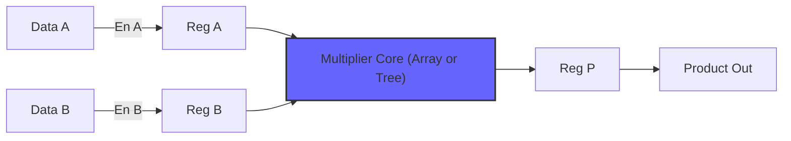
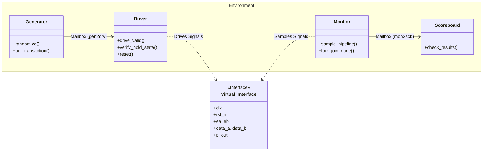

# Design and Verification of Multipliers in SystemVerilog


## Project Overview

This repository contains a parameterized implementation of integer multipliers in **SystemVerilog**. The project allows for the generation of multipliers of any bit-width (e.g., 8, 16, 32, 64-bit) by modifying a single parameter.

It features two distinct multiplier architectures:
1. **Array Multiplier**
2. **Adder Tree Multiplier**

Both architectures are wrapped in a synchronous interface with registered inputs and outputs, suitable for pipelined designs.

## Key Features

1. **Parameterized Bit-Width:** Define the input width (N) to generate an NxN multiplier with a 2N-bit product.
2. **Dual Architecture:**
* `array_mult_core`: Row-ripple structure.
* `adder_tree_core`: Tree-based reduction structure.


3. **Synchronous Interface:**
* Input Registers with Enable (`ea`, `eb`).
* Output Register for error-free sampling.
* Active-Low Asynchronous Reset (`rst_n`).


4. **Layered Testbench:** A complete SystemVerilog layered verification environment including randomized inputs, driver, monitor, and a self-checking scoreboard.

## Directory Structure

```text
systemverilog-multiplier-design/
├── rtl/
│   ├── array/                  # Array Multiplier Architecture
│   │   ├── top.sv              # Wrapper for Array Multiplier
│   │   ├── array_mult.sv       # Array Multiplier Core
│   │   ├── n_bit_adder.sv      # Row-Ripple Adder
│   │   └── full_adder.sv       # 1-bit Full Adder
│   │
│   ├── tree/                   # Adder Tree Architecture
│   │   ├── top.sv              # Wrapper for Tree Multiplier
│   │   └── adder_tree_mult.sv  # Adder Tree Core
│   └── top_if.sv               # Top-Level Interface Definition
│
├── tb/
│   ├── multiplier_pkg.sv       # Testbench Package
│   ├── top_tb.sv               # Top-Level Testbench Module
│   ├── interface.sv            # Interface
│   ├── environment.sv          # Environment Class
│   ├── driver.sv               # Driver Class
│   ├── monitor.sv              # Monitor Class
│   ├── scoreboard.sv           # Scoreboard Class
│   └── transaction.sv          # Transaction Class
│
├── sim/
│   └── run.do                  # ModelSim/QuestaSim Execution Script
│
├── syn/
│   ├── array/                  # Quartus Project for Array Multiplier
│   │   ├── array_mult.qpf
│   │   └── array_mult.qsf
│   │
│   └── tree/                   # Quartus Project for Adder Tree
│       ├── adder_tree_mult.qpf
│       └── adder_tree_mult.qsf
│
└── docs/
    └── report.pdf              # Detailed Project Report
```

## Architecture Details

### 1. Top-Level Wrapper

The top-level module instantiates the selected core (Array or Adder Tree) and handles the registering of inputs and outputs.

* **Parameters:** `WIDTH` (Default: 8)
* **Inputs:** `clk`, `rst_n`, `ea`, `eb`, `data_a[WIDTH-1:0]`, `data_b[WIDTH-1:0]`
* **Outputs:** `p_out[2*WIDTH-1:0]`

#### Top-Level Block Diagram


### 2. Array Multiplier Core

Uses a NxN-grid of AND gates to generate partial products, which are summed using a ripple-carry structure. While area-efficient for small bit-widths, the delay scales linearly $O(N)$.

### 3. Adder Tree Core

Uses a tree structure to reduce partial products in logarithmic time $O(\log N)$, significantly improving speed but increasing routing complexity

## How to Run

### Simulation

The project includes a reusable layered testbench. To run the simulation using ModelSim/QuestaSim:

1. Navigate to the `sim/` directory.
2. Run the .do script:
```bash
do run.do <type> <width>
```
3. Examples:
```bash
do run array 8
do run tree 16
```
*(Note: If not specified, `TYPE` is set to array and `WIDTH` is set to 8 by default.*

### Synthesis

1. Open your synthesis tool (Quartus Prime) and create a new project.
2. Add all files from the `rtl/` folder.
3. Set the Top-Level Entity to the top module.
4. Configure the parameter `WIDTH` to your desired size (e.g., 8, 16, 32).
5. Compile and check the RTL Viewer to verify multiplier structure.

## Verification Strategy

The testbench follows a layered verification methodology:

* **Generator:** Creates random `A` and `B` input transactions.
* **Driver:** Drives signals onto the virtual interface, handling reset and enable.
* **Monitor:** Observes input and output ports.
* **Scoreboard:** Compares the DUT output against a golden reference model ().

* **Transaction:** Defines the atomic payload with randomized input vectors (`rand A`, `rand B`).
* **Driver:** Drives synchronous signals and injects **random noise** (invalid data with `enable` low) to verify input stability.
* **Monitor:** Uses multi-threading to correctly track **pipelined transactions**, matching inputs to outputs across clock cycles.
* **Scoreboard:** Self-checking "Golden Reference" that compares the DUT output against a behavioral model ($P = A \times B$).  


## Verification Strategy

The design is verified using a Layered SystemVerilog Testbench.

### Testbench Architecture
The environment is built dynamically using UVM-style component classes connected via mailboxes.



### Why this is better:
1.  **"Pipeline Awareness":** This is a key feature. Standard monitors often fail with pipelined designs because they block. Your use of `fork...join_none`  is a specific, advanced technique worth highlighting.
2.  **"Noise Injection":** You aren't just driving good data; you are explicitly testing the `ea`/`eb` logic by toggling it off randomly[cite: 34]. This proves robustness.
3.  **Synchronization:** Explicitly mentioning the termination logic  shows you handled t


## Author

**Adil R. Channa**

* **GitHub:** [adilrchanna](https://github.com/adilrchanna)
* **Project:** SystemVerilog Multiplier Design

---

### License

This project is licensed under the MIT License - see the [LICENSE](https://www.google.com/search?q=LICENSE) file for details.
